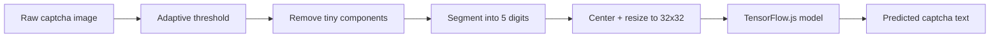

# Captcha OCR TFJS

這是一個用 TensorFlow.js 製作的五位數驗證碼辨識專案。專案包含完整的訓練資料、訓練程式、推論程式與已訓練好的 baseline model，可以直接拿來重訓、批次推論，或整合到其他 Node.js 專案。

本專案目前辨識數字 `1` 到 `9`，不包含 `0`。

## 專案亮點

- 使用 TensorFlow.js 訓練並輸出標準 `model.json` + `.bin` 權重檔。
- 內建自適應二值化，能處理彩色字、淡色背景與不同字元顏色。
- 自動切割五位數驗證碼，將每個 digit 正規化後送入模型。
- 提供單張推論、批次推論、訓練與 smoke test。
- 批次推論會輸出 HTML、CSV、JSON，也會保留二值化與切割後的圖片，方便 debug。
- GitHub Actions 已設定基本 CI，可在 push / pull request 時檢查程式與模型推論。

## Demo

範例驗證碼：

| Raw captcha | Expected | Predicted |
| --- | --- | --- |
|  | `14662` | `14662` |
|  | `99511` | `99511` |
|  | `33888` | `33888` |

單張推論範例：

```bash
npm run solve -- data/raw/14662.png
```

輸出範例：

```json
{
  "text": "14662",
  "confidence": 0.9994,
  "segmentMethod": "projection",
  "digits": [
    { "index": 0, "label": "1", "confidence": 0.9975 },
    { "index": 1, "label": "4", "confidence": 0.9999 },
    { "index": 2, "label": "6", "confidence": 1.0000 },
    { "index": 3, "label": "6", "confidence": 0.9999 },
    { "index": 4, "label": "2", "confidence": 0.9999 }
  ]
}
```

目前 baseline 在本資料集的驗證結果：

| Check | Result |
| --- | --- |
| Held-out test accuracy | `100%` |
| Raw filename-labeled examples | `25/25` correct |
| Supported labels | `1-9` |
| Captcha length | `5 digits` |

> 以上結果是使用此 repo 內提供的樣本與目前模型取得。若驗證碼樣式改變，建議新增樣本並重新訓練。

## How It Works



影像處理流程：

1. 將 PNG/JPEG 轉成灰階。
2. 使用 local mean 做自適應二值化。
3. 移除過小雜訊 connected components。
4. 用垂直投影切出 5 個 digit；若字元太接近，會嘗試拆分較寬的區段。
5. 每個 digit crop 後置中、padding、resize 成 `32x32`。
6. 送入 TensorFlow.js model 輸出 `1-9` 的分類結果。

## Project Structure

```text
captcha-ocr-tfjs/
  .github/workflows/ci.yml      GitHub Actions CI
  data/
    segmented/                  Training data, folders 1-9 are labels
    raw/                        Five-digit raw captcha examples
  docs/
    data-format.md              Data layout and labeling rules
    inference.md                Inference notes
    training.md                 Training notes
  model/                        TensorFlow.js model.json and weights
  scripts/
    train.js                    Train model and output confusion matrix
    predict.js                  Batch inference with HTML/CSV/JSON report
    solve-file.js               Single image inference
  src/
    ocr.js                      Reusable Node.js OCR API
    image-utils.js              Thresholding, segmentation, normalization
    tf.js                       TensorFlow.js loader
    tfjs-io.js                  Model load/save helpers
  test/
    smoke.js                    Basic inference tests
  vendor/
    tf.min.js                   TensorFlow.js fallback bundle
```

## Installation

```bash
npm install
```

需求：

- Node.js 18+
- npm

## Single Image Inference

```bash
npm run solve -- data/raw/14662.png
```

也可以直接執行：

```bash
node scripts/solve-file.js data/raw/14662.png
```

指定模型路徑：

```bash
node scripts/solve-file.js data/raw/14662.png --model-dir=model
```

## Batch Inference

```bash
npm run predict
```

預設路徑：

- Model: `model/`
- Input: `data/raw/`
- Output: `reports/raw-predictions/`

輸出內容：

```text
reports/raw-predictions/
  report.html                   Visual report
  predictions.csv               Flat table for spreadsheet analysis
  predictions.json              Full result with confidence and bbox
  binarized/                    Adaptive-threshold images
  digits/                       Segmented 32x32 digit images
```

如果 raw 檔名是五位數，例如 `14662.png`，batch report 會把檔名視為 ground truth，並計算 accuracy。

## Training

```bash
npm run train
```

預設讀取：

```text
data/segmented/
  1/
  2/
  ...
  9/
```

每個子目錄名稱就是 label，裡面的圖片必須是單一 digit。

訓練輸出：

```text
model/
  model.json
  group1-shard1of1.bin
  labels.json
  preprocessing.json

reports/training/
  confusion-matrix.csv
  metrics.json
  training-report.html
```

常用參數：

```bash
node scripts/train.js --epochs=20 --batch-size=32 --image-size=32
node scripts/train.js --data-dir=data/segmented --model-dir=model --report-dir=reports/training
```

## Use As A Library

可以從其他 Node.js 專案直接引用：

```js
const { solveCaptchaFile } = require("./src/ocr");

async function main() {
  const result = await solveCaptchaFile("data/raw/14662.png", {
    modelDir: "model"
  });

  console.log(result.text);
  console.log(result.confidence);
}

main();
```

輸出：

```text
14662
0.9994300484657288
```

## Testing

```bash
npm run check
npm test
```

`npm test` 目前會用 repo 內的 baseline model 驗證：

- `data/raw/14662.png -> 14662`
- `data/raw/99511.png -> 99511`

## Maintenance Notes

- 新增訓練樣本時，將切割好的單字圖片放到 `data/segmented/<label>/`。
- 若驗證碼樣式、字型、背景或顏色規則改變，建議先新增樣本再重新訓練。
- 重新訓練後請執行 `npm test` 和 `npm run predict` 檢查結果。
- `reports/` 是推論與訓練產物，已在 `.gitignore` 中排除。

## Portfolio Notes

這個專案展示了：

- 如何將影像前處理、資料集管理、模型訓練與推論流程整理成可維護工具。
- 如何用 TensorFlow.js 在 Node.js 環境完成模型訓練與部署。
- 如何輸出可追蹤的模型 artifacts、混淆矩陣與推論報告。
- 如何設計 CLI、library API、測試與 GitHub Actions，讓 ML prototype 更接近可維護專案。

## License

MIT
